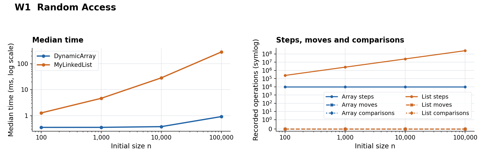
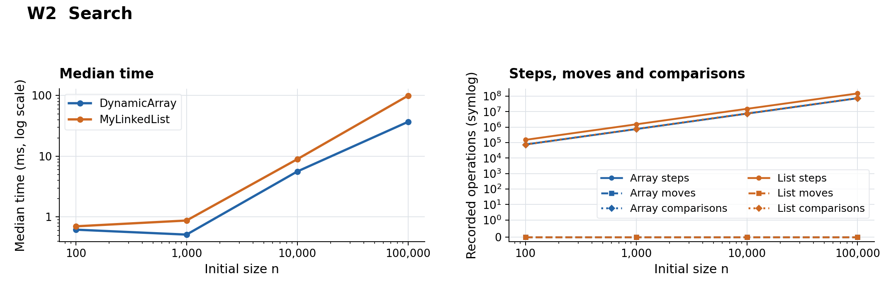
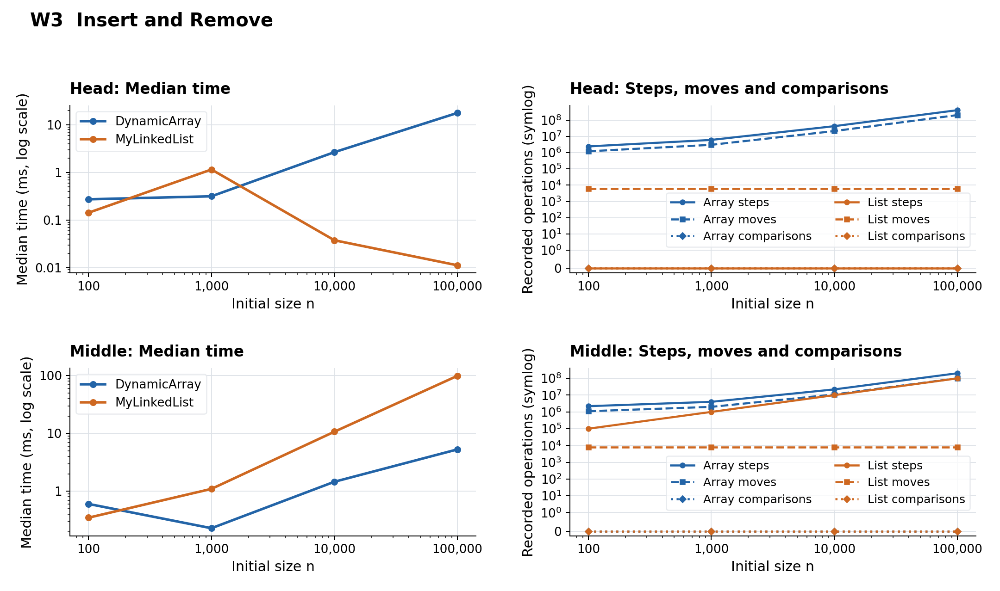
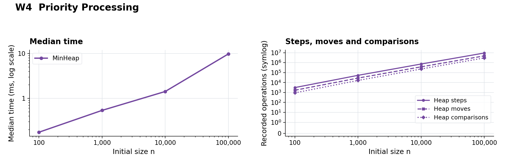

# DAA Assignment 2 Report

## 1. Asymptotic Bounds

Here n is the number of stored elements; indexed-operation averages assume uniformly chosen valid positions, and search averages assume uniformly located successful queries or a fixed fraction of absent queries.

### DynamicArray

| Operation | Best Case | Average Case | Worst Case | Auxiliary Space | Reason |
|:---|:---|:---|:---|:---|:---|
| `add(x)` | $\Theta(1)$ | $\Theta(1)$ amortized | $\Theta(n)$ | $\Theta(n)$ on resize; $\Theta(1)$ otherwise | Appending is constant; doubling copies n elements occasionally. |
| `add(index, x)` | $\Theta(1)$ | $\Theta(n)$ | $\Theta(n)$ | $\Theta(n)$ on resize; $\Theta(1)$ otherwise | Insertion shifts n - index elements; appending without growth is constant. |
| `remove(index)` | $\Theta(1)$ | $\Theta(n)$ | $\Theta(n)$ | $\Theta(1)$ | Removal shifts n - index - 1 elements; the last position needs no shift. |
| `get(index)` | $\Theta(1)$ | $\Theta(1)$ | $\Theta(1)$ | $\Theta(1)$ | The value is read directly from its array index. |
| `contains(x)` | $\Theta(1)$ | $\Theta(n)$ | $\Theta(n)$ | $\Theta(1)$ | A match at the first position is immediate; absence scans the full array. |
| `getSize()` | $\Theta(1)$ | $\Theta(1)$ | $\Theta(1)$ | $\Theta(1)$ | The stored size field is returned directly. |

### MyLinkedList

| Operation | Best Case | Average Case | Worst Case | Auxiliary Space | Reason |
|:---|:---|:---|:---|:---|:---|
| `add(x)` | $\Theta(1)$ | $\Theta(1)$ | $\Theta(1)$ | $\Theta(1)$ | The tail reference allows a fixed number of pointer updates. |
| `add(index, x)` | $\Theta(1)$ | $\Theta(n)$ | $\Theta(n)$ | $\Theta(1)$ | Boundary insertion is constant; middle insertion first traverses the list. |
| `remove(index)` | $\Theta(1)$ | $\Theta(n)$ | $\Theta(n)$ | $\Theta(1)$ | Unlinking is constant after traversal to the requested node. |
| `get(index)` | $\Theta(1)$ | $\Theta(n)$ | $\Theta(n)$ | $\Theta(1)$ | getNode traverses from the closer boundary: min(index, n - 1 - index) links. |
| `contains(x)` | $\Theta(1)$ | $\Theta(n)$ | $\Theta(n)$ | $\Theta(1)$ | Sequential search may stop at the head or visit the entire list. |

### MinHeap

| Operation | Best Case | Average Case | Worst Case | Auxiliary Space | Reason |
|:---|:---|:---|:---|:---|:---|
| `insert(x)` | $\Theta(1)$ | $O(\log n)$ amortized | $\Theta(n)$ | $\Theta(n)$ on resize; $\Theta(1)$ otherwise | Bubble-up visits at most the heap height; array growth can copy n elements. |
| `peekMin()` | $\Theta(1)$ | $\Theta(1)$ | $\Theta(1)$ | $\Theta(1)$ | The minimum is stored at the root, data[0]. |
| `extractMin()` | $\Theta(1)$ | $O(\log n)$ | $\Theta(\log n)$ | $\Theta(1)$ | Bubble-down can stop immediately or descend through the heap height. |

Insertion bounds marked amortized spread the cost of resizing over many insertions; heap average entries use O because no key distribution is assumed. Auxiliary space means extra working memory per operation, including a temporary resize buffer; total storage for every structure is Θ(n).

---

## 2. Loop Invariants

Counter increments are omitted below because they do not affect the stored values.

### DynamicArray.contains(x)

```java
for (int i = 0; i < size; i++) {
    if (arr[i] == x) return true;
}
return false;
```

- **Invariant:** Before each iteration, 0 <= i <= size, and none of arr[0..i-1] equals x.
- **Initialization:** At i = 0, the checked prefix is empty, so the invariant holds.
- **Maintenance:** If arr[i] == x, returning true is correct. Otherwise, i++ adds one non-matching element to the checked prefix and preserves the invariant.
- **Termination:** The index increases until an element is found or i == size. In the latter case, every element differs from x, so returning false is correct.
- **Conclusion:** The method returns true exactly when x is stored in the array, including correct behavior for an empty array.

### DynamicArray.remove(index)

Assume a valid index; let A be the original array, m its original size, and p the removed index.

```java
for (int i = index; i < size - 1; i++) {
    arr[i] = arr[i + 1];
}
size--;
```

- **Invariant:** Before each iteration, size = m and p <= i <= m - 1; positions before p and at or after i are unchanged. Each position k in p..i-1 contains A[k+1].
- **Initialization:** Initially i = p, the processed range is empty, and the entire array still equals A.
- **Maintenance:** Since arr[i+1] is still A[i+1], the assignment places the next original value into arr[i]. After i++, the processed range extends by one position and the remaining positions stay unchanged.
- **Termination:** At i = m - 1, all positions p..m-2 contain their expected successors. Decreasing size to m - 1 excludes the stale final cell from the logical array.
- **Conclusion:** Valid removal preserves the original order of every other element. Removing the last element needs no shift and is handled by size--.

---

## 3. Empirical Analysis and Plots

The supplied results.csv contains 36 cases for n = 100, 1,000, 10,000 and 100,000; each case uses two warm-up runs followed by the median of five measured runs. Time is measured with System.nanoTime() and converted to milliseconds; the generator starts with new Random(42).

Data source: [results.csv](results/results.csv).

| Workload | Measured operations |
|:---|:---|
| W1 | 10,000 random get(index) calls after filling each structure. |
| W2 | 1,000 contains(x) queries: 500 drawn from the data and 500 independently generated. |
| W3 | 1,000 insertions followed by 1,000 removals at index 0 (head) or initial n / 2 (middle). |
| W4 | n heap insertions followed by n extractMin() calls; the code checks non-decreasing output. |

Every figure shows measured time and all three recorded counters; n uses a logarithmic axis, time uses a logarithmic scale, and counters use a symmetric logarithmic scale so zeros remain visible. Overlapping curves indicate equal recorded values.

### W1 Random Access



At n = 100,000, DynamicArray takes 0.9192 ms and MyLinkedList takes 284.1461 ms (about 309 times slower); array steps remain 10,000, while list traversal reaches 251,581,935 steps.

### W2 Search



At n = 100,000, DynamicArray takes 36.8762 ms and MyLinkedList takes 99.2601 ms (about 2.69 times slower); both perform about 74-75 million comparisons.

### W3 Insert and Remove



At n = 100,000, head operations take 17.9723 ms for the array and 0.0112 ms for the list; middle operations take 5.2971 ms and 99.3802 ms respectively. Head list operations record 6,000 moves independent of n, while the array records 201 million moves.

### W4 Priority Processing



At n = 100,000, priority processing takes 9.8187 ms and records 2,959,797 comparisons; its increasing operation count is consistent with the O(n log n) workload bound.

---

## 4. Discussion

DynamicArray provides constant-time indexed access, and contiguous int storage improves cache locality during iteration and search. MyLinkedList requires pointer traversal, while node headers and links increase memory use and allocation overhead. These costs can make the list slower even with similar logical work, although the benchmark does not isolate individual causes.

For head insertions and removals, the list avoids array shifts, but middle operations still require traversal by index. MyLinkedList suits frequent boundary operations, while MinHeap suits priority processing by repeatedly extracting the smallest value. Small-case timings can vary because of JVM compilation or measurement overhead, so the results indicate trends rather than prove asymptotic bounds.

### Measurement Limits

- Input matching: structures receive different random inputs; W2 does not verify absent queries.
- Counters: resize copies, peekMin() reads and final bubble-up comparisons are omitted; steps include some writes and node-value visits.
- Sample alignment: time uses the median run time, while counters describe the last run.
- Timed work: W3/W4 include random-value generation; W4 also includes the output-order check.
